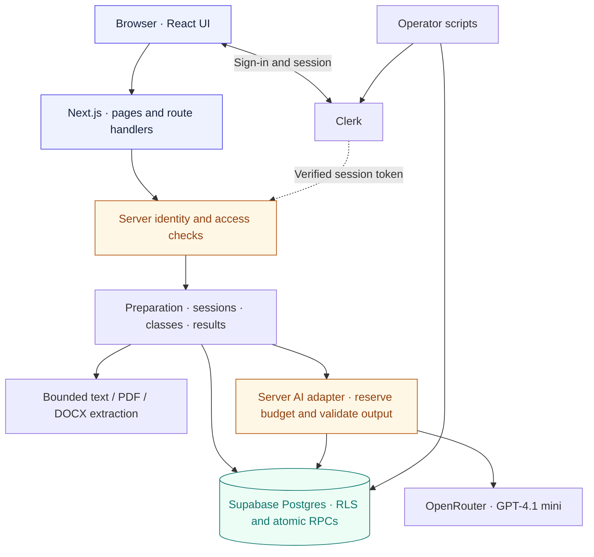
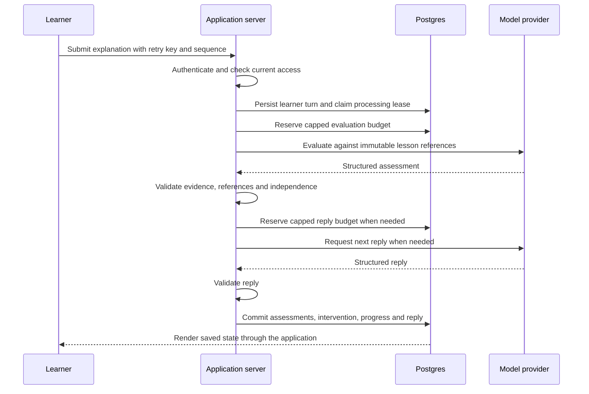

<p align="center">
  
</p>

<h1 align="center">Errby</h1>
<p align="center"><strong>Learn it by teaching it.</strong><br />Your idea. Your explanation. One curious AI learning partner.</p>
<p align="center">
  📚 Pick an idea &nbsp; · &nbsp; 💬 Explain an idea &nbsp; · &nbsp; 🛡️ Work through mistakes &nbsp; · &nbsp; 🌱 Build understanding
</p>
<p align="center">
  <a href="#for-learners">The product</a> ·
  <a href="#for-developers">The architecture</a> ·
  <a href="#run-locally">Run locally</a> ·
  <a href="docs/SETUP_STATUS.md">Project status</a>
</p>

---

<a id="for-learners"></a>

## 01 · For learners

### 👋 Meet the student you get to teach

You can recognise a definition and still struggle to explain it. Errby gives you someone to explain it to: a curious AI character that asks questions, gets selected ideas wrong, and invites you to help it understand.

Start with a message or paste your notes. Put the idea into your own words. Work through a misunderstanding. Leave with a clearer picture of what you explained and what needs another attempt.

**You do the explaining. Errby keeps the conversation going.** An AI Supervisor checks understanding in the background; Errby brings corrections and uncertainty into the conversation.

<p align="center">
  
</p>

### ✨ The current hackathon flow

Sign in or sign up → `/learn` → start chatting. The student teaches Errby; Errby asks questions. Attach a readable PDF/DOCX directly in the composer or paste notes. There is no teacher dashboard, class joining, or lesson-planning screen.

Opening replies stream from OpenRouter; the ungraded conversation stays in the current browser tab. Reference notes start saved, evidence-based practice with live preparation and answer-processing status. Assessed replies appear after validation and saving. The existing private objectives, Supervisor, evidence checks and retry handling run internally. Progress panels are hidden; corrections appear in the conversation through Errby. A topic alone is not a factual answer key, and uncertainty cannot complete learning.

Attachments accept PDF/DOCX up to 4 MiB, within the hosted request ceiling. Upload progress, cancellation, extraction coverage and a text preview precede an explicit action to use the text. Existing drafts are retained until that action. Imported notes remain unreviewed; only the selected text is used, and the original file is not stored. For sources over 8,000 characters, the preview explicitly offers the first 8,000; edit before sending or use a shorter document. Scans require pasted readable text.

Saved practice is private and available from Recent chats. The demo is visibly fictional and does not run AI, accept personal uploads or save learning. Teacher/class/preparation pages and their public APIs remain retired; the new chat attachment endpoint reuses the existing bounded parser. Historical schema and domain checks are preserved rather than destructively rewritten.

[Agreed plan and limits](docs/implementation/CHAT_FIRST_PLAN.md) · [Observed verification](docs/SETUP_STATUS.md)

### 💬 A little lesson in heat transfer

> **Fictional, prewritten and unreviewed illustration.** This conversation is not a grading result.

| Speaker      | Conversation                                                                                   |
| ------------ | ---------------------------------------------------------------------------------------------- |
| 🤖 **Errby** | Why does an ice cube melt in a warm room?                                                      |
| 👤 **You**   | Energy transfers from the warmer surroundings to the colder ice. That energy can melt the ice. |
| 🤖 **Errby** | So the ice makes the heat it needs to melt?                                                    |
| 👤 **You**   | No. The energy comes from the warmer surroundings. The ice does not make its own heat.         |
| 🤖 **Errby** | Then why could wrapping the ice in an insulating material slow its melting?                    |

If you agree with the mistaken idea, the Supervisor can step in with a correction and ask you to explain a fresh example. Copying that correction does not count as independent evidence.

### 🖼️ A visual tour

The images below are **design concepts with fictional sample data**, reused from the repository. They illustrate the product journeys; they are not current application screenshots, verified grades or evidence of student outcomes. Exact screens may differ.

| 📚 Choose what to teach                                                                                                          | 📝 Prepare and review                                                                                                                         |
| -------------------------------------------------------------------------------------------------------------------------------- | --------------------------------------------------------------------------------------------------------------------------------------------- |
|  |  |
| Start from a topic, your notes or a class lesson.                                                                                | Check the goals and supporting material before publishing.                                                                                    |

| 🛡️ Work through an idea                                                                                                                                             | 🌱 Look back at your learning                                                                                                                       |
| ------------------------------------------------------------------------------------------------------------------------------------------------------------------- | --------------------------------------------------------------------------------------------------------------------------------------------------- |
|  |  |
| Errby asks; you explain; the Supervisor offers feedback.                                                                                                            | Review each goal and the explanations behind its status.                                                                                            |

### 🌱 What the progress labels mean

| Label             | In plain language                                         |
| ----------------- | --------------------------------------------------------- |
| ✅ **Explained**  | Your answer provides valid evidence for this lesson goal. |
| ◐ **Developing**  | This idea needs another explanation.                      |
| ○ **Untested**    | There is no evidence for this goal yet.                   |
| ❔ **Unverified** | The answer or supporting evidence could not be confirmed. |

Every required goal needs valid learner evidence before a lesson can finish. These labels describe an idea in a lesson, not a child's ability or a school grade. AI feedback can be wrong; it does not replace a teacher or establish subject-wide mastery.

### 📎 What can I bring?

| Material                         | What to expect                                                                                                                  |
| -------------------------------- | ------------------------------------------------------------------------------------------------------------------------------- |
| A topic or short outline         | Sets the lesson scope; add reference text to support factual claims.                                                            |
| Pasted notes                     | Supplies readable material for lesson preparation and source references.                                                        |
| Text-based PDF or DOCX           | Extracts readable text and reports missing or unsupported content.                                                              |
| A webpage or video link          | Supply permitted source text or a transcript alongside the link. Errby does not automatically read the page or watch the video. |
| A scan, image or audio recording | Convert it to readable text first; OCR, voice and video teaching are outside this version.                                      |

Errby is designed for school-age learners, from primary through high school, using typed English. Younger learners may need help reading or typing. The web interface supports phones and larger screens; there is no native app.

### 🚪 Getting started and availability

In live mode, students can sign up with a username and password and go straight to their dashboard. No teacher invitation, student email or class membership is required. Sign-in also opens the dashboard (or the protected page you originally requested). Students can prepare private material or join a class later with its code. Teacher access still requires administrator approval.

For a local tour, follow [Run locally](#run-locally). Demo mode needs no credentials or model spending. Live mode adds saved sessions, classes and configured AI processing.

Errby is a development prototype. Human lesson approval, school/pupil pilot work and production acceptance remain open. No public deployment, learning-gain study or universal AI accuracy is claimed. See the [current verification record](docs/SETUP_STATUS.md) for what has actually been checked.

---

<a id="for-developers"></a>

## 02 · For developers

### 🏗️ Architecture at a glance

Errby is a **Next.js App Router monolith**. React renders the learning experience; server-only domain modules handle identity, authorization, ingestion, preparation, AI calls and session processing. Supabase Postgres holds canonical application state. Clerk handles authentication, while roles and class membership remain in the application database.



Supabase verifies Clerk tokens through its native third-party authentication integration. Server session clients retain row-level security (RLS); privileged operations use a separate server-only client with explicit application checks. Private Storage policies exist, but the current ingestion path saves extracted content in Postgres and does **not** persist source binaries to Storage.

| Layer                    | Technology in this repository                                | Responsibility                                                                                   |
| ------------------------ | ------------------------------------------------------------ | ------------------------------------------------------------------------------------------------ |
| 🖥️ Application           | Next.js 16.3.5 · React 19.3.0 · TypeScript 6.0.3             | Server-rendered pages, interactive UI and same-origin API routes.                                |
| 🎨 Interface             | Tailwind CSS 4 · Radix/shadcn patterns · Phosphor and Lucide | Shared controls, responsive layouts, labelled feedback and theme support.                        |
| 🔑 Identity              | Clerk                                                        | Sign-in, sign-up, account UI and verified sessions.                                              |
| 🗄️ Persistence           | Supabase Postgres                                            | Profiles, classes, source text, immutable lesson versions, sessions, evidence and budget ledger. |
| 🧠 AI                    | OpenRouter · `openai/gpt-4.1-mini` · Zod                     | Structured drafts, validated assessments and checked Errby replies.                              |
| 📄 Ingestion             | PDF.js · Mammoth                                             | Bounded PDF/DOCX text extraction through worker threads.                                         |
| 🧪 Verification          | Node test runner/tsx · PGlite · Playwright                   | Domain checks, Docker-free SQL validation and browser journeys.                                  |
| 🚀 Hosting configuration | Vercel · Node 24.x · npm 11.x                                | Repository deployment configuration; deployment is a separate step.                              |

Exact dependency pins live in [package.json](package.json) and [package-lock.json](package-lock.json). The [colour and screen guide](docs/Errby-Colour-and-Screen-Guide.md) and [palette tokens](docs/visual-design/palette-tokens.json) govern presentation.

### 🔄 How the learning loop works

There are three AI responsibilities: **preparation**, **evaluation/Supervisor**, and **Errby's next reply**. They have separate prompts and schemas inside one application, rather than autonomous agents exchanging messages.



**Preparation:** validate type, size and ownership; extract source text and location markers; collect missing context; save a resumable job; generate and validate a source-bound draft. Teacher publication creates an immutable reviewed version. Eligible private practice remains explicitly AI-generated and not teacher-reviewed. Steps advance through authorized requests while the preparation view is open; closing it does not imply a background worker keeps running.

**Teaching:** session and preparation leases fence stale workers. Expected sequences and idempotency keys prevent conflicting or repeated submissions from silently advancing state. Provider calls run outside database transactions. Failed processing can be retried from the saved learner turn; completed provider responses can be reused after interrupted application writes.

**Evidence:** assessments connect learner responses to objectives and source references. Correctness alone is insufficient when an answer is copied or assisted. Uncertainty cannot complete an objective, and all required objectives need valid evidence before completion. Results expose scoped summaries and audited teacher assessment revisions; activity time is a bounded estimate.

### 🔐 Identity, privacy and operational boundaries

- **Clerk identity is separate from application approval.** A protected UUID mapping links a verified Clerk subject and issuer to a profile. Roles are not self-selected or taken from editable user metadata. Legacy accounts require reviewed linking, never an automatic email merge.
- **Access is checked on the server and in SQL.** Current ownership, active class membership and teacher class scope govern private reads and mutations. Private sessions stay outside class reporting. Cookie-based mutations require the expected origin; private responses use `no-store`.
- **Service and model credentials remain server-only.** `NEXT_PUBLIC_CLERK_PUBLISHABLE_KEY` is public configuration; it is not a secret. No service, database password or model credential belongs in a `NEXT_PUBLIC_` variable.
- **Spending must be enabled and reserved first.** The synthetic operator controls cap spending at $1 total and $0.03 per call, with new reservations stopping at 90% of the total cap. Ambiguous provider outcomes retain reserved liability until reconciliation; retries cannot blindly dispatch another paid call.
- **Retention needs an operator.** Maintenance supports redaction after 30 days and session deletion after 90 days. Scheduling is not configured, so automatic retention is not claimed. Account deletion has separate identity and owned-class safeguards.

See [Clerk identity and migration](docs/implementation/CLERK_AUTH.md), [operations and budget controls](docs/implementation/T17_OPERATIONS.md), and [privacy requirements](docs/specification/PRIVACY_AND_SAFETY.md). Current Clerk instructions supersede historical Supabase Auth guidance.

<a id="run-locally"></a>

### 🛠️ Run locally

Use Windows PowerShell, Node **24.18.0**, npm **11.16.0**, and the existing lockfile. Local checks are Docker-free; do not use local Docker Desktop or its engine.

From the repository root:

```powershell
npm ci
if (-not (Test-Path .env.local)) { Copy-Item .env.example .env.local }
$env:ERRBY_MODE = 'demo'
npm run dev
```

Open the [landing page](http://127.0.0.1:3000/) or [learning workspace](http://127.0.0.1:3000/learn). Stop with Ctrl+C. If port 3000 is occupied, use `npm run dev -- --port 3001`.

Demo needs no credentials and makes no model calls. Preparation can perform real bounded text/sample-document extraction, but demo does not create accounts or persist learning to a hosted database. Live mode fails closed instead of falling back to fictional data.

<details>
<summary><strong>🔌 Configure a hosted synthetic environment</strong></summary>

Use a dedicated non-local Supabase test project and a matching Clerk development instance. Follow [Clerk setup, student registration, migration and validation](docs/implementation/CLERK_AUTH.md) first. Apply repository migrations in filename order and configure native Clerk/Supabase integration. Student profiles are created automatically on authenticated access; legacy identity linking requires operator review. The current account command accepts learners only. Setting keys alone is insufficient. Match `ERRBY_APP_ORIGIN` to the exact browser hostname and server port.

Keep real values in ignored `.env.local` or deployment secrets, never source files or command arguments. [.env.example](.env.example) lists the supported settings.

| Variable                                   | Purpose                                                                          |
| ------------------------------------------ | -------------------------------------------------------------------------------- |
| `ERRBY_MODE`                               | `demo` or `live`; defaults to demo.                                              |
| `NEXT_PUBLIC_CLERK_PUBLISHABLE_KEY`        | Public configuration for the matching Clerk instance.                            |
| `CLERK_SECRET_KEY`                         | Server-only Clerk credential.                                                    |
| `CLERK_ISSUER_URL`                         | Exact trusted HTTPS issuer without a trailing slash.                             |
| `ERRBY_APP_ORIGIN`                         | Exact browser origin, including the local port.                                  |
| `SUPABASE_URL`, `SUPABASE_PUBLISHABLE_KEY` | Hosted project and RLS session-client configuration.                             |
| `SUPABASE_SECRET_KEY`                      | Privileged server operations after application authorization.                    |
| `OPENROUTER_API_KEY`, `OPENROUTER_MODEL`   | Server provider configuration; model is `gpt-4.1-mini` or `openai/gpt-4.1-mini`. |
| `SUPABASE_DB_URL`                          | Migration-only connection; use the hosted session pooler where required.         |
| `ERRBY_OPERATOR_CONFIRM`                   | `synthetic-test-project` opt-in for operator actions.                            |

After configuring live mode, clear a shell-level demo override and restart on the configured origin:

```powershell
Remove-Item Env:ERRBY_MODE -ErrorAction SilentlyContinue
npm run dev
```

Use synthetic accounts and fictional material. Enable paid calls only with authorized reservations and caps. No real pupil data belongs in development.

</details>

### 🧭 Routes and repository map

| Route                                          | Purpose                                                                                                          |
| ---------------------------------------------- | ---------------------------------------------------------------------------------------------------------------- |
| `/`                                            | Public landing page and prewritten examples.                                                                     |
| `/sign-in`, `/sign-up`, `/setup`, `/account`   | Authentication, student registration and account settings.                                                       |
| `/learn`                                       | Direct chat entry and private saved conversations.                                                               |
| `/learn/sessions/[id]`                         | Compatibility redirect to the main chat screen.                                                                  |
| `/learn/sessions/[id]/results`                 | Learner recap and evidence.                                                                                      |
| `/api/chat`, `/api/sessions/*`, `/api/account` | Same-origin server endpoints; see the [access matrix](docs/implementation/CLERK_AUTH.md#actual-access-surfaces). |

```text
src/
├── app/                       Pages and server route handlers
├── components/                Landing, workspace and shared UI
└── lib/
    ├── auth/ · db/             Identity, approval and database clients
    ├── ingestion/             Text, PDF and DOCX extraction
    ├── preparations/          Saved jobs and immutable lesson drafts
    ├── lessons/               Contracts, examples and review
    ├── ai/                    Budgeted provider, evaluation and replies
    ├── sessions/              Saved turns, recovery and evidence
    ├── classes/ · results/    Scoped reporting and teacher review
    └── env/ · http/           Configuration and request boundaries
supabase/migrations/           Schema, RLS and atomic transactions
scripts/                       Account and operations commands
tests/                         Domain, SQL, integration and browser checks
docs/                          Specifications, design and verification records
public/images/                 Existing Errby and learner artwork
```

### 🧪 Verification and current limits

```powershell
npm run check
$env:ERRBY_MODE = 'demo'
npm run build
npx playwright install chromium
npm run test:browser
```

`check` runs ESLint, route generation/TypeScript, local tests including PGlite, and formatting. `npm run db:test` is the focused Docker-free SQL check. `npm run build` uses Webpack, following repeated local Turbopack builds that did not complete. Browser tests start a demo server on port 3100; free that port before running them. With `CI=true`, they use the existing production build and one worker; otherwise they use the development server. Upload-route packaging checks were retired with the upload routes.

| Evidence                         | What it establishes                                                           | What it does not establish                                          |
| -------------------------------- | ----------------------------------------------------------------------------- | ------------------------------------------------------------------- |
| Local contracts and PGlite tests | Schema, deterministic behavior and SQL authorization logic under the harness. | Live Clerk sessions, hosted RLS integration or Storage.             |
| Demo/mocked browser tests        | UI behavior, recovery, responsive layouts and tested keyboard interactions.   | Real model accuracy, billing or human accessibility acceptance.     |
| Hosted synthetic checks          | Only the actual routes, identities and calls exercised in the dated record.   | Production readiness, school approval or educational effectiveness. |

**Current authentication status:** the recorded Clerk password login, protected Supabase read, refresh and sign-out passed on 30 September. Expanded hosted write/RLS checks, signup/recovery, guarded deletion and full migration acceptance remain pending. The earlier 27 September Supabase Auth results are historical. Final Clerk verification was handed to the user; see [setup status](docs/SETUP_STATUS.md) and the [Clerk validation record](docs/implementation/CLERK_AUTH.md#validation-record), including its dependency findings.

Parsing is bounded to **10 MiB**, **50 PDF pages**, **30,000 extracted characters** and a **15-second extraction limit**. Remote page fetching, video watching, OCR and voice are not implemented. Screenshots and traces belong in ignored `test-results/` and should be inspected before sharing.

<details>
<summary><strong>🚀 Hosting and deployment notes</strong></summary>

The root [vercel.json](vercel.json) selects Next.js, `npm ci` and `npm run build`; import with root directory `.` and the framework's default output directory. The package permits Node 24.x/npm 11.x; local patch pins remain in the repository.

For a fictional demo, set `ERRBY_MODE=demo`. For live mode, configure the application variables listed above for both build and runtime, complete hosted identity/database setup, then verify the deployed flows. Migration and operator credentials do not belong in the deployed application. Builds do not apply migrations or enable model spending.

The documented Vercel Functions [request-body limit](https://vercel.com/docs/functions/limitations#request-body-size) is 4.5 MB, below the app's local 10 MiB document allowance. Use smaller documents or pasted text; larger uploads require a separate direct-to-storage flow. [.vercelignore](.vercelignore) excludes local secrets and generated artifacts. Keep `docs/specification/EXAMPLE_LESSON.json`, which demo imports at build time.

Deployment and hosted runtime verification are separate from pushing repository changes. The [historical release guide](docs/implementation/T20_RELEASE.md) contains the demonstration checklist; use current Clerk instructions for authentication.

</details>

### 📖 Deeper documentation and credits

| Read                                                                                                            | For                                                                                          |
| --------------------------------------------------------------------------------------------------------------- | -------------------------------------------------------------------------------------------- |
| [Setup status](docs/SETUP_STATUS.md)                                                                            | Latest observed evidence, blockers and remaining acceptance.                                 |
| [Product brief](docs/specification/PRODUCT_BRIEF.md) · [learning design](docs/specification/LEARNING_DESIGN.md) | Product intent, goals and evidence rules.                                                    |
| [Implementation index](docs/implementation/README.md)                                                           | Module-level behavior and verification notes.                                                |
| [Clerk authentication](docs/implementation/CLERK_AUTH.md)                                                       | Current identity architecture, configuration and migration.                                  |
| [API contracts](docs/specification/API_CONTRACTS.md) · [data model](docs/specification/DATA_MODEL.md)           | Specification context; reconcile older planning documents with current implementation notes. |
| [Design guide](docs/Errby-Colour-and-Screen-Guide.md)                                                           | Authoritative palette, speaker semantics and screen concepts.                                |
| [Landing verification](docs/animation/verification.md)                                                          | Actual landing screenshots, motion checks and their limits.                                  |

OpenAI Codex substantially assisted implementation, migrations, tests, documentation and visual concepts from the supplied specifications. Existing character artwork and screen concepts are reused here; examples remain fictional and unreviewed. The team must review and accurately attribute AI-assisted work.

Third-party dependencies and exact versions are recorded in the package files. The Button follows the [MIT-licensed shadcn/ui Radix pattern](https://github.com/shadcn-ui/ui/blob/main/LICENSE.md); the application uses Lucide and Phosphor icons. Engineering checks do not establish learning gains, school participation or model quality.

<p align="center"><br /><strong>Pick an idea. Explain it to Errby.</strong></p>
